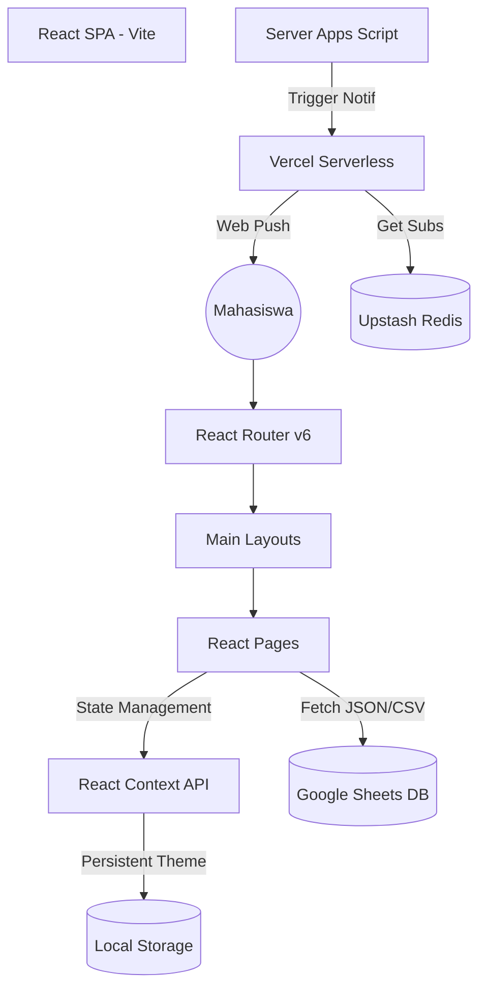

# Arsitektur Sistem Modern (React 18)

F.AGRIELLA saat ini menggunakan arsitektur **Modern Single Page Application (SPA)** berbasis React 18 dan Vite. Arsitektur ini memisahkan logika antarmuka (Frontend) dengan data (Backend) secara lebih modular dan efisien dibandingkan versi HTML statis sebelumnya.

## 1. Diagram Ekosistem (Mermaid)

---

## 2. Stack Teknologi Utama

| Komponen | Teknologi | Peran |
| :--- | :--- | :--- |
| **Framework** | React 18 | Library utama untuk UI berbasis komponen. |
| **Bundler** | Vite | Build tool super cepat untuk pengembangan modern. |
| **Styling** | Tailwind CSS | Desain utilitas untuk UI yang konsisten dan responsif. |
| **Animation** | Framer Motion | Animasi halus dan transisi antar halaman. |
| **Icons** | Phosphor Icons | Set ikon premium dan konsisten di seluruh aplikasi. |
| **Routing** | React Router | Navigasi dinamis tanpa reload halaman. |

---

## 3. Siklus Hidup & Sinkronisasi

### A. Client-Side Routing
Berbeda dengan website lama yang setiap klik menu melakukan reload, F.AGRIELLA sekarang menggunakan **Client-Side Routing**. Hanya komponen yang berubah yang akan di-render ulang, memberikan pengalaman navigasi yang instan secepat aplikasi mobile native.

### B. State Management
Pengaturan tema (Dark/Light) dan status login/admin dikelola secara global menggunakan **React Context API**. Ini memastikan sinkronisasi yang sempurna di semua halaman tanpa perlu melempar data antar komponen secara manual.

### C. Data Ingestion (Hybrid CMS)
Website tetap menggunakan **Google Sheets** sebagai basis data utama. Data materi di-fetch secara asinkron saat halaman dimuat. Jika koneksi lambat, React akan menampilkan *Skeleton Loading* atau *Spinner* yang halus untuk menjaga kenyamanan visual (User Experience).

---

## 4. Keunggulan Sistem Sekarang
1.  **Modularitas**: Setiap fitur (Spin, Upload, Arsip) adalah komponen independen yang mudah dikembangkan tanpa merusak fitur lainnya.
2.  **Performa Tinggi**: Minimnya ukuran file JavaScript yang dikirim ke browser berkat teknik *Tree Shaking* dari Vite.
3.  **Aksesibilitas (PWA)**: Dukungan penuh untuk instalasi di layar utama HP dengan performa "Zero-Lag" (tanpa bayangan dan blur berat pada mobile).

> [!IMPORTANT]
> **React Readiness**: Pastikan untuk selalu menjalankan `npm run dev` saat pengembangan untuk melihat perubahan secara instan (HMR) dan `npm run build` sebelum melakukan deploy ke Vercel untuk memastikan kode terminifikasi dengan sempurna.
